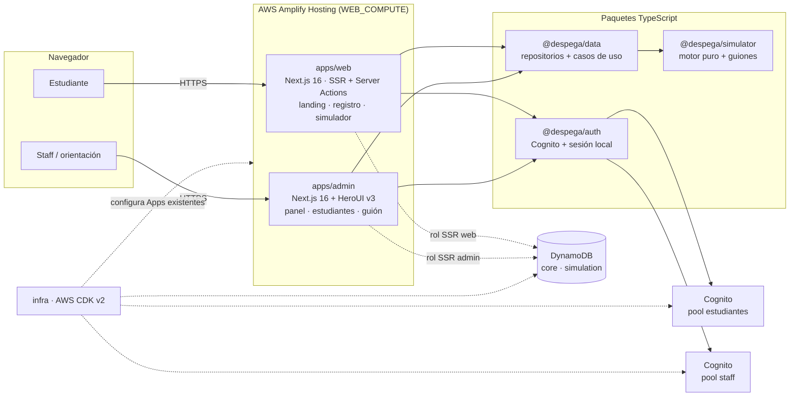

# Arquitectura de DESPEGA

Estado: prototipo funcional local, 2026-09-26. Infraestructura AWS definida en CDK y
validada con `synth`; sin cuentas AWS asignadas todavía.

## Objetivos

- Que un estudiante viva la semana completa de Ingeniería de Software: 3 sesiones, las 5
  mecánicas de interacción, relojes visibles, memoria entre sesiones y resultados.
- Guardar desempeño y perfil de afinidad **por carrera** desde el primer día.
- Reutilizar la misma mecánica para 14 carreras cambiando solo contenido.
- Operar en AWS con el menor número de piezas: sin API Gateway ni Lambdas de dominio.
- Dar al equipo de DESPEGA y a orientadores un backoffice con resultados y trazabilidad.

## Componentes

| Pieza | Responsabilidad |
| --- | --- |
| `apps/web` | Landing pública, registro/ingreso de estudiantes, `/inicio`, hub de carrera con resultados y reproductor del simulador. |
| `apps/admin` | Backoffice con HeroUI: panel del piloto, estudiantes, detalle con registro de decisiones, reinicio de intentos y visor del guión. |
| `packages/simulator` | Tipos del contenido, motor (`applySceneResponse`, `startSession`, `getPublicScene`), afinidad, validación y los módulos de carrera. Sin I/O. |
| `packages/data` | Esquema DynamoDB, repositorios y casos de uso (`ensureCareerProgress`, `beginSession`, `submitSceneResponse`, `restartCareer`, `careerOverview`). |
| `packages/auth` | Cognito del lado del servidor (login, registro, confirmación, recuperación, refresh, revocación, verificación JWT) y la sesión local firmada. |
| `infra` | Stack `Despega-<stage>`: tablas, pools de Cognito, roles de Amplify y variables de rama. |

## Sin API Gateway: cómo fluye una decisión

1. El Server Component de `/simulador/[careerId]/jugar` lee el progreso con
   `ensureCareerProgress` y entrega al cliente la **escena pública** (sin respuestas).
2. El reproductor muestra la escena; el estudiante responde (opción, clasificación,
   frases, emparejamiento…). El reloj corre en el navegador.
3. El navegador invoca la Server Action `submitSceneAction` con
   `{ runId, version, sceneId, elapsedMs, response }`.
4. La acción valida con Zod, verifica la sesión y llama a `submitSceneResponse`.
5. `submitSceneResponse` relee el progreso, aplica el motor puro y guarda estado y
   evento en una sola `TransactWriteItems`, condicionada a la versión leída.
6. La respuesta trae la consecuencia (reacción, deltas), el progreso y la siguiente
   escena, ya resuelta con la memoria actualizada.

La concurrencia optimista evita que dos pestañas avancen el mismo intento. Un conflicto
se resuelve releyendo el progreso (`reloadProgressAction`).

## Identidad

| Superficie | AWS (`dev`/`prd`) | Local |
| --- | --- | --- |
| Web | Pool de estudiantes con registro propio y verificación por correo. `USER_PASSWORD_AUTH` del lado del servidor; tokens en cookies `httpOnly` (`SameSite=Lax`, `__Host-` en producción). | Solo correo; cookie firmada `despega_web_local`. |
| Admin | Pool de staff sin registro propio; `NEW_PASSWORD_REQUIRED` para el primer ingreso; grupos `despega/admin` y `despega/counselor`. Cookies `SameSite=Strict`. | Correo y rol elegido en el login. |

`proxy.ts` (Next.js 16, runtime Node) protege rutas y renueva tokens antes del SSR.
`lib/auth.ts` vuelve a verificar firma, emisor y audiencia en cada lectura. Las Server
Actions tienen además la verificación de origen propia de Next.js.

## Simulador

El motor interpreta contenido declarativo: sesiones, escenas, interacciones y
resultados. Detalles en `simulator-engine.md`. El guión del piloto y los supuestos
tomados sobre el documento funcional están en `functional-analysis.md`.

## Datos

Dos tablas (`core` y `simulation`), cada una con un índice justificado. El progreso
guarda el estado completo del motor más un resumen proyectado para el backoffice. Cada
decisión queda como evento inmutable por intento. Detalles en `data-model.md`.

## Ambientes

`dev` (rama `develop`) y `prd` (rama `main`), cuentas separadas por Control Tower
(pendientes de crear). Detalles en `environments-and-deployment.md`.

## Costo

- DynamoDB on-demand; dos tablas y dos GSI de proyección acotada.
- Sin Lambdas ni API Gateway: el cómputo es el SSR de Amplify, que escala con el
  tráfico.
- Cognito Essentials; el correo de verificación usa el envío de Cognito en el piloto
  (límite diario bajo). Para producción con muchos estudiantes, configurar SES.

## Límites conocidos del prototipo

- Los agregados del backoffice paginan índices hasta un tope (1.000 registros de
  progreso, 500 estudiantes en búsqueda). Para volumen real conviene mantener contadores
  al escribir y un índice de búsqueda.
- Las URLs de `dev`/`prd` en los `.env.develop`/`.env.production` son marcadores
  `*.despega.example`: reemplazarlas por los dominios reales antes de desplegar.
